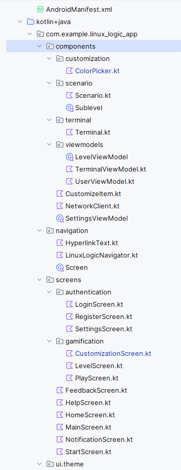

# Mobile App (Frontend) Linux Logic

In diesem Ordner wird das Frontend der App Linux Logic entwickelt, dabei soll dieses möglichst kulant und anwenderfreundlich sein, mit der Intention Linux-Kenntnisse vermitteln zu können und soll dabei einen Gamification Aspekt miteinbeziehen.

## Inhaltsverzeichnis

- **Einleitung**
- **Projektbeschreibung**
  - Forschungsfragen
  - Geplantes Ergebnis
- **Technologie-Stack**
  - Technologieauswahl
- **Installationsanleitung**
  - Voraussetzungen
  - Build & Run
- **Architektur und Abhängigkeiten**
  - Verzeichnisstruktur
  - Wichtige externe Libraries
- **Detaillierte Beschreibung der Dateien**
- **Navigation und UI-Fluss**

---

## Einleitung

Linux Logic ist eine innovative Lernplattform, die einen spielerischen und interaktiven Zugang zur Linux-Welt ermöglicht. Mit Hilfe von Containern und simulierten Terminal-Umgebungen bietet die App praxisnahe Übungen für Einsteiger und Fortgeschrittene. Dieses Dokument beschreibt den technischen Aufbau und die Implementierung des Android-Frontends dieses Projekts.

---

## Projektbeschreibung

Die mobile App von **Linux Logic** wurde unter Verwendung von Jetpack Compose für das UI-Design entwickelt. Sie ermöglicht das Durchlaufen interaktiver Level, die in verschiedene Sublevel unterteilt sind. Die Nutzer interagieren über eine WebSocket-basierte Terminal-Emulation, um praxisnahe Aufgaben in einer echten Linux-Umgebung zu lösen.

### Forschungsfragen

+ Wie kann die Entwicklung eines Frontends für die mobile Applikation "Linux Logic“, welche für das Android-Betriebssystem konzipiert ist, realisiert werden? 
+ Besteht das Potenzial die App gebrauchstauglich und intuitiv zu gestalten? 
+ Kann durch den Einsatz innovativer Technologien ein erleichterter Einstieg in Linux ermöglicht werden? 
+ Inwieweit können vielfältige Lern-Szenarien und praxisorientierte Übungen ein abwechslungsreiches und effektives Lernen von Linux auf mobilen Geräten optimal unterstützen?

### Geplantes Ergebnis

Im Rahmen des Diplomprojekts wird die Entwicklung eines voll funktionsfähigen Frontends der mobilen Applikation angestrebt, das in Design, Funktionalität und bis zur Backend-Anbindung vollständig realisiert ist. 
Darüber hinaus erfolgt eine umfassende Evaluierung der Gebrauchstauglichkeit, um eine optimale User Experience sicherzustellen.

---

## Technologie-Stack

### Haupttechnologien:

- **Programmiersprache:** Kotlin
- **Architektur:** MVVM (Model-View-ViewModel)
- **UI-Framework:** Jetpack Compose
- **Navigation:** Jetpack Compose Navigation
- **State Management:** ViewModel
- **Netzwerkkommunikation:** WebSockets
- **Design-Prinzipien:** Material Design 3

### Technologieauswahl:

**Jetpack Compose:**

- Dies ist das moderne UI-Toolkit von Android, welches einem deklarative Programmierparadigma entspricht und eng mit nativen Android-APIs integriert ist. Es eignet sich hervorragend für Android-spezifische Apps, bietet jedoch weniger plattformübergreifende Flexibilität.
- Vorteile:
  - Native Android-Integration: Es besteht ein einfacher Zugriff auf Android-spezifische APIs für Animationen, Backend-Funktionen, Navigation usw.
  - Optimale Performance: Die direkte Nutzung von Android-Ressourcen ist reich an Performance, da die Architektur nicht komplexer und erweitert wird, wodruch kein Overhead durch zusätzliche Engines entsteht.
  - Klares UI-Design: Mit deklarativen UI-Ansätzen lassen sich einfache und intuitive Benutzeroberflächen gestalten. (Ähnelt vom Prinzip her sehr der parallelen Technologie SwiftUI für die iOS-Entwicklung)
- Nachteile:
  - Kein plattformübergreifender Support: Da diese Technologie nativ für Android angedacht ist benötigt es eine separate Implementierungen für andere Betriebssysteme.
  - Limitierte Libraries spezifische Funktionen: Im Vergleich zu Cross-Plattform-Technologien gibt es weniger fertige Lösungen für sehr individuelle Komponente, beispielsweise webbasierte oder plattformübergreifende Terminals.

---

## Installationsanleitung

### Voraussetzungen:

- **Android Studio** (aktuelle Version Meerkat, Stand 01.04.2025)
- **Minimum-SDK:** 24
- **Target-SDK:** 34
- **Compile-SDK**: 35
- **Internetverbindung** für die WebSocket-Kommunikation

### Build & Run:

1. Klonen Sie das Repository:
   
   ```bash
   git clone https://github.com/aaabdulkarim/linux-logic.git
   ```

2. Öffnen Sie das Projekt in Android Studio.
   
   [Die neuste Android-Studio Version zum Download](https://developer.android.com/studio)

3. Synchronisieren Sie die Abhängigkeiten über das Gradle-File `build.gradle.kts (Module :app)`

4. Wählen Sie einen Emulator oder ein physisches Gerät.

5. Starten Sie die App mit der Schaltfläche Run in der oberen Leiste.

---

## Architektur und Abhängigkeiten

### Verzeichnisstruktur:



### Wichtige externe Libraries:

```kts
dependencies {
    // Externe Libraries
    // https://mvnrepository.com/artifact/androidx.compose.ui/ui-text-google-fonts
    implementation(libs.androidx.ui.text.google.fonts)
    // https://mvnrepository.com/artifact/androidx.navigation/navigation-compose
    implementation(libs.androidx.navigation.compose)
    // https://mvnrepository.com/artifact/androidx.compose.animation/animation
    implementation(libs.androidx.animation)
    // https://mvnrepository.com/artifact/androidx.compose.material/material-icons-extended
    implementation(libs.androidx.material.icons.extended)
    // https://mvnrepository.com/artifact/com.squareup.okhttp3/okhttp
    implementation(libs.okhttp)
    // https://mvnrepository.com/artifact/com.github.skydoves/colorpicker-compose
    implementation("com.github.skydoves:colorpicker-compose:1.1.2")
}
```

---

## Detaillierte Beschreibung der Dateien

### AndroidManifest.xml:

- Definiert die grundlegenden App-Konfigurationen und Berechtigungen

- Legt das Backup-Verhalten, das App-Icon, das Theme und Netzwerksicherheitsregeln fest.

- Bestimmt den Einstiegspunkt der Anwendung (MainActivity) über einen Intent-Filter.

### MainActivity.kt:

- **Funktion:**  
  - Einstiegspunkt der App; lädt die Compose-Oberfläche mittels `setContent`.
  - Aktiviert Edge-to-Edge-Rendering für ein modernes UI-Design.
  - Initialisiert das `UserViewModel` und übergibt es an den Navigator (`LinuxLogicNavigator`), der den UI-Fluss steuert.
- **Besonderheiten:**  
  - Verwendet das globale App-Theme (`Linux_logic_appTheme`).

---

### Package components:

#### Sub-Package customization:

##### ColorPicker.kt:

* **Funktion:** Implementiert ein interaktives Composable zur Auswahl von Farben, das in den individuellen Anpassungsbildschirmen verwendet wird.

* **Details:** Enthält einen HSV-ColorPicker der Skydoves Library

#### Sub-Package: scenario:

##### Scenario.kt:

- **Funktion:** Definiert die Datenklasse für ein Lern-Szenario (Kurs).
- **Details:** Enthält Attribute wie ID, Name, Beschreibung, Bildreferenz und eine geordnete Liste von Sublevels (mittels LinkedHashMap). Bietet Methoden zur Verwaltung und Navigation zwischen den Sublevels.

##### Sublevel.kt:

- **Funktion:** Definiert die Datenklasse für ein einzelnes Sublevel.
- **Details:** Speichert Eigenschaften wie ID, Beschreibung und einen Boolean, der den Abschlussstatus angibt. Zeigt exemplarisch, wie dynamische Namensgenerierung implementiert werden könnte.

#### Sub-Package terminal:

##### Terminal.kt:

- **Funktion:** Implementiert ein interaktives Terminal-Interface als Compose Composable.
- **Details:** Erlaubt die Kommunikation über WebSockets, verarbeitet Benutzereingaben und zeigt Ausgaben an. Unterstützt einen Live- sowie einen Preview-Modus.

#### Sub-Package viewmodels:

##### LevelViewModel.kt:

- **Funktion:** Verwaltet den Fortschritt innerhalb eines Levels bzw. Sublevels.
- **Details:** Speichert den aktuellen Level-Index reaktiv (mittels mutableIntStateOf) und bietet Funktionen zur Ermittlung des aktuellen Sublevels, zur dynamischen Namensgenerierung (z. B. „Level 1“) und zum Wechseln zum nächsten Sublevel.

##### TerminalViewModel.kt:

- **Funktion:** Zustandsverwaltung für die Terminalfarben und UI-bezogene Logik.
- **Details:** Hält den aktuellen Farb-State als reaktiven Zustand, ermöglicht das Aktualisieren der Farben und schaltet zwischen benutzerdefinierten und Default-Farben.

##### UserViewModel.kt:

- **Funktion:** Zentrale Verwaltung der Benutzerdaten und des Authentifizierungsprozesses.
- **Details:** Speichert Informationen wie Benutzername, E-Mail und Passwort. Beinhaltet umfangreiche Validierungslogik, Methoden für Login, Registrierung, Datenaktualisierung, Passwortverifizierung und Logout. Verknüpft außerdem TerminalViewModel und LevelViewModel mit dem aktuellen Benutzer.
- **Besonderheit:** Dieses UserViewModel ist global über die gesamte Applikation bekannt und inkludiert die beiden anderen ViewModels, sodass eine klare Trennung der Funktionen herrscht, jedoch alles hier fusioniert.

---

### Package navigation:

#### LinuxLogicNavigator.kt:

- **Funktion:** Definiert das Navigationsframework der App.
- **Details:** Legt die Startdestination fest und implementiert Ein- und Austritts-Animationen (z. B. Slide-Transitions). Verknüpft alle relevanten Screens (wie Start, Login, Register, Main, Level, Settings, Notifications, Feedback, Help) über definierte Routen.

#### Screens.kt:

- **Funktion:** Zentrale Definition der einzelnen Screen-Routen.
- **Details:** Enthält Konstanten oder Enums, die die verschiedenen Routen der App darstellen, und vereinfacht so den Navigationsprozess.

---

### Package screens:

#### Sub-Package authentication:

##### LoginScreen.kt:

- **Funktion:** Implementiert den Login-Prozess.
- **Details:** Bietet Eingabefelder für E-Mail und Passwort, validiert die Eingaben, zeigt Fehlermeldungen an und erlaubt das Umschalten der Passwortsichtbarkeit. Bei erfolgreichem Login navigiert er zum MainScreen.

##### RegisterScreen.kt:

- **Funktion:** Ermöglicht die Registrierung eines neuen Nutzers.
- **Details:** Beinhaltet Felder für Benutzername, E-Mail, Passwort und Passwortbestätigung. Validiert alle Eingaben, zeigt entsprechende Fehlermeldungen an und navigiert nach erfolgreicher Registrierung zum LoginScreen.

##### SettingsSceen.kt:

- **Funktion:** Zeigt den Bildschirm zur Verwaltung der Benutzereinstellungen.
- **Details:** Ermöglicht dem Nutzer, Account-Informationen einzusehen und zu bearbeiten. Enthält eine AccountSettingsCard, die direkt mit dem UserViewModel verknüpft ist.

#### Sub-Package gamification:

##### Customization.kt:

- **Funktion:** Bietet die Möglichkeit, die Terminalfarben individuell anzupassen.
- **Details:** Integriert eine ColorCustomizationCard und eine Vorschau (PreviewTerminal), um Änderungen an den Terminalfarben in Echtzeit zu visualisieren.

##### LevelScreen.kt:

- **Funktion:** Zeigt den aktuellen Fortschritt eines Levels an.
- **Details:** Zeigt eine LevelCard, die den Namen und die Beschreibung des aktiven Sublevels darstellt, sowie ein interaktives Terminal. Enthält auch Snackbar- und CompletionDialog-Mechanismen, um Erfolgsmeldungen anzuzeigen.

##### PlayScreen.kt:

- **Funktion:** Präsentiert eine Liste aller verfügbaren Kurse.
- **Details:** Nutzt SharedTransitionLayout und AnimatedVisibility, um Kurskarten animiert ein- und auszublenden. Bei Auswahl eines Kurses werden detaillierte Informationen in CourseEditDetails angezeigt und der LevelScreen wird gestartet.

#### HomeScreen.kt:

- **Funktion:** Zeigt den aktuellen Fortschritt und bietet einen Button zum nahtlosen Weiterspielen.
- **Details:** Integriert ein Terminal-Composable, um interaktive Inhalte anzuzeigen.

#### MainScreen.kt:

- **Funktion:** Dient als zentraler Hub der App.
- **Details:** Enthält Drawers, eine TopAppBar und eine BottomNavigationBar zur Navigation zwischen den Hauptfunktionen der App.

#### StartScreen.kt:

- **Funktion:** Der Begrüßungsbildschirm der App.
- **Details:** Erleichtert den Einstieg, zeigt ein ansprechendes Hintergrundbild, Links zur Linux Logic Webseite sowie Navigationsoptionen zu Login und Registrierung.

---

### Package ui.theme:

#### Color.kt:

- **Funktion:** Definiert die Farbpalette der Anwendung.
- **Details:** Enthält Farbwerte für primäre, sekundäre und unterstützende Farben, die im gesamten UI verwendet werden.

#### Theme.kt:

- **Funktion:** Legt das globale App-Theme fest.
- **Details:** Umschließt das MaterialTheme mit den definierten Farb- und Typographie-Schemata und unterstützt dynamische Farbwahl (auf Android 12+).

#### Type.kt:

- **Funktion:** Definiert die Typographie der App.
- **Details:** Enthält Schriftfamilien und Textstile, die eine einheitliche Typographie in der gesamten Anwendung sicherstellen.
